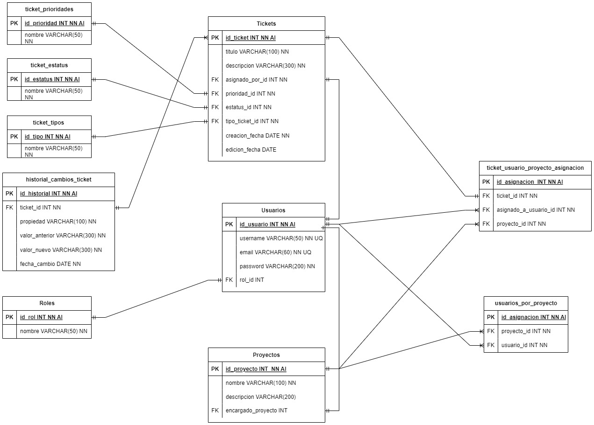

# API Bug tracker
## Modelo entidad relacion

## Roles y sus acciones

- Administrador
    - Crear, editar y eliminar proyectos.
    - Asignacion de proyecto a project managers
    - Gestiona los roles de los usuarios ++
    - Todas las acciones del project manager

- Project Manager
    - Crear y editar tareas
    - Asignar tareas a los desarrolladores
    - Establecer prioridades y plazos para las tareas.
    - Gestionar el progreso del proyecto y el estado de las tareas.

- Developer
    - Recibir tareas asignadas por el Project Manager.
    - Actualizar el estado de la tarea a medida que se completa.

---

